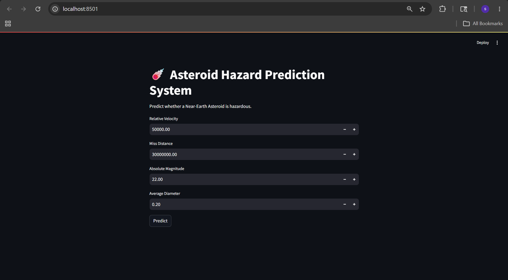
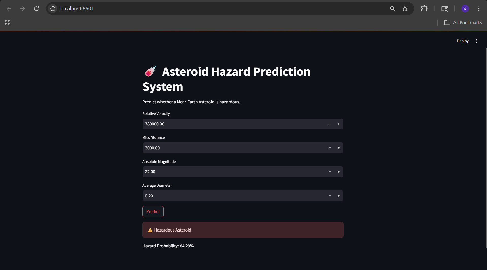
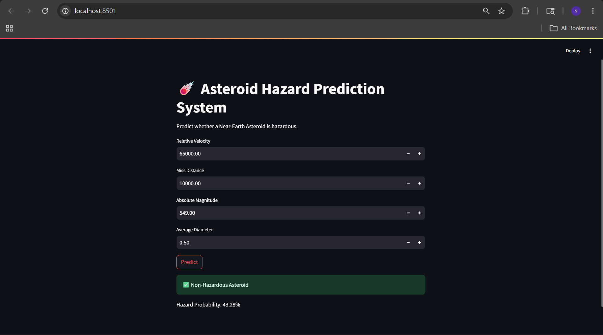

# ☄️ Asteroid Hazard Prediction System

A Machine Learning web application that predicts whether a Near-Earth Asteroid (NEA) is hazardous based on its physical and orbital characteristics.

---

## 🚀 Live Demo

🔗 https://asteroid-hazard-prediction-veunrokxjpsrwlajmqzheu.streamlit.app/

---

## 📸 Application Screenshots

### 🏠 Home Page



### ⚠️ Hazardous Asteroid Prediction



### ✅ Non-Hazardous Asteroid Prediction



---

## 📌 Project Overview

This project uses Machine Learning to classify Near-Earth Asteroids as **Hazardous** or **Non-Hazardous** using observational data from NASA's Near-Earth Object (NEO) database.

The complete pipeline includes:

- Data Cleaning
- Exploratory Data Analysis (EDA)
- Feature Engineering
- Class Imbalance Handling
- Model Training
- Model Evaluation
- Web Application Deployment

The final model is deployed using **Streamlit Community Cloud** and can make real-time predictions based on user inputs.

---

## 📊 Dataset Information

**Source:** NASA Near-Earth Object Dataset

**Total Records:** 90,836 Asteroids

**Target Variable:** `hazardous`

### Class Distribution

| Class | Percentage |
|---------|-----------|
| Non-Hazardous | ~90.3% |
| Hazardous | ~9.7% |

This significant imbalance required specialized techniques during model development.

---

## 🔧 Feature Engineering

### Original Features

- Estimated Diameter Minimum
- Estimated Diameter Maximum
- Relative Velocity
- Miss Distance
- Absolute Magnitude

### Engineered Feature

Average Diameter was created using:

```python
avg_diameter = (est_diameter_min + est_diameter_max) / 2
```

### Final Features Used

- Relative Velocity
- Miss Distance
- Absolute Magnitude
- Average Diameter

---

## 🤖 Machine Learning Pipeline

### Data Preprocessing

- Removed irrelevant columns
- Converted target labels
- Handled missing values
- Created engineered features
- Train-Test Split (80:20)
- Stratified Sampling

### Class Imbalance Handling

Since hazardous asteroids represented less than 10% of the dataset, multiple techniques were explored:

- Baseline Random Forest
- Random Forest with Class Weights
- SMOTE (Synthetic Minority Oversampling Technique)

### Algorithms Evaluated

1. Random Forest Classifier
2. Random Forest + Class Weights
3. Random Forest + SMOTE

---

## 📈 Model Evaluation

### Metrics Used

- Accuracy
- Precision
- Recall
- F1 Score
- Confusion Matrix

### Final Selected Model

Random Forest Classifier

### Performance

| Metric | Score |
|----------|---------|
| Accuracy | 92% |
| Precision (Hazardous) | 0.62 |
| Recall (Hazardous) | 0.36 |
| F1 Score (Hazardous) | 0.46 |

### Confusion Matrix

```text
[[16011   389]
 [ 1123   645]]
```

Interpretation:

- Correctly identified 16,011 non-hazardous asteroids
- Correctly identified 645 hazardous asteroids
- Maintained high overall accuracy while reducing false alarms

---

## 🎯 Feature Importance Analysis

| Feature | Importance |
|----------|------------|
| Absolute Magnitude | 38.6% |
| Average Diameter | 30.1% |
| Relative Velocity | 16.8% |
| Miss Distance | 14.6% |

### Key Insight

The model determined that:

- **Absolute Magnitude** is the strongest predictor of asteroid hazard status.
- **Average Diameter** is the second most influential factor.
- Velocity and miss distance contribute but are comparatively less important.

---

## 🌐 Deployment

### Frontend

- Streamlit

### Backend

- Scikit-Learn
- Joblib

### Version Control

- Git
- GitHub

### Cloud Hosting

- Streamlit Community Cloud

---

## 🛠️ Tech Stack

### Programming Language

- Python

### Data Analysis

- Pandas
- NumPy

### Visualization

- Matplotlib
- Seaborn

### Machine Learning

- Scikit-Learn
- Imbalanced-Learn (SMOTE)

### Deployment

- Streamlit
- Joblib

### Development Tools

- Jupyter Notebook
- Git
- GitHub

---

## 📂 Project Structure

```text
asteroid_hazard_prediction/
│
├── app/
│   └── streamlit_app.py
│
├── data/
│   └── raw/
│
├── models/
│   └── asteroid_hazard_model.pkl
│
├── notebooks/
│   └── asteroid_analysis.ipynb
│
├── images/
│   ├── home.png
│   ├── hazardous_prediction.png
│   └── safe_prediction.png
│
├── requirements.txt
├── README.md
└── .gitignore
```

---

## ▶️ Run Locally

### Clone Repository

```bash
git clone https://github.com/Sanjeev-Karnatapu/asteroid-hazard-prediction.git
```

### Navigate to Project

```bash
cd asteroid-hazard-prediction
```

### Install Dependencies

```bash
pip install -r requirements.txt
```

### Run Application

```bash
streamlit run app/streamlit_app.py
```

---

## 🎓 Skills Demonstrated

- Data Cleaning & Preprocessing
- Exploratory Data Analysis (EDA)
- Feature Engineering
- Handling Imbalanced Datasets
- SMOTE Oversampling
- Random Forest Classification
- Model Evaluation & Validation
- Feature Importance Analysis
- Model Serialization using Joblib
- Streamlit Application Development
- Git & GitHub Version Control
- Cloud Deployment

---

## 👨‍💻 Author

**Sanjeev Karnatapu**

B.Tech Computer Science Engineering (AI & ML)

Vellore Institute of Technology, Vellore

GitHub: https://github.com/Sanjeev-Karnatapu